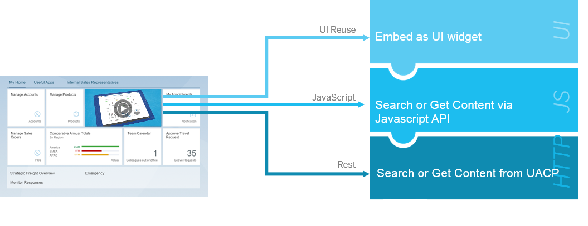

## Implementation Options

For the implementation, the APIs are offered as REST APIs and JavaScript APIs. In addition, for the Search, you can simply use predefined widgets.

The APIs return the content in JSON format.

Search widgets

-   html

-   SAPUI5

