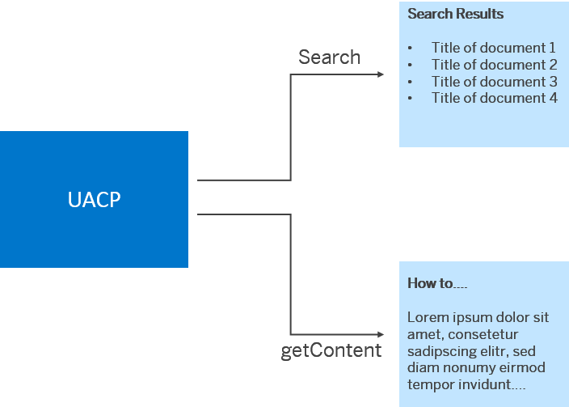
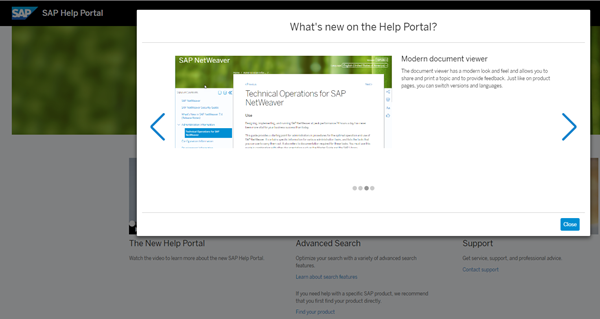

## Introduction

This is a test document to experiment with collaboration with internal and external colleagues - April 21 .... 

Here is a new parameter.
Adding a list:
- this is a new line
- add another line
- test build + upload

With the Search API, you can retrieve a list of documents according to the search parameters you have specified. Clicking on one of the search hits opens the document in the UACP viewer. The Content API however, retrieves the content itself which can then be viewed in a viewer of your choice.

In both cases, you can use the APIs for providing a context-sensitive help in your application, or for offering the information on a Web site.

> Note:
> Displaying what's new information in a popup: 
> 
> 

Features of the Search API:

- Search the complete SAP Help Portal content
- Use filters, for example, product, deliverable, version, and language filters
- Search for a LOIO
- Use paging for the result list

Features of the Content API:

- Retrieve content of a topic specified by deliverable loio, topic loio, and version
- Specify the content further by language, format, and state

