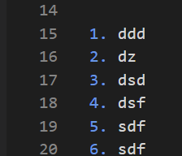

# Heading 1
This is my text

1. first
2. second
3. third

# Heading 2
This is my testing topic
again test topic
- a list
- another one
  - sub lis

1. ddd
2. dz
3. rf
4. dfd
5. dfd

[this is my link](https://marketplace.visualstudio.com/items?itemName=docsmsft.docs-authoring-pack)

> This is a quote

And I will enter an image.
  

> [!NOTE]
> This is an information 

> [!WARNING]
> and this is a warning

|Column1  |Column2  |Column3  |Column4  |
|---------|---------|---------|---------|
|col1     |col2     |         |         |
|Row2     |         |         |         |

[Heading 1](new.md)

<image type="content" src="../images/1a311146ec0016570a7169001fa74d2b623746814598dec256daca8112cc27bd.png" alt-text="alt text">