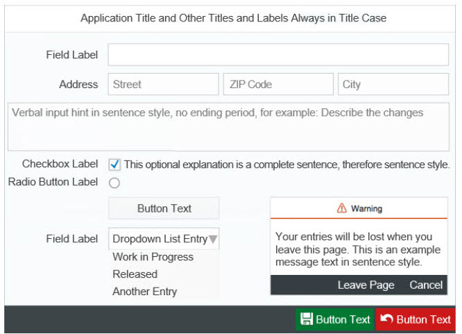

# User Interface Element Texts

This section discusses guidelines on translating common UI element texts.

*Provide guidelines on translating titles, labels, or descriptions of common UI elements below with regards to capitalization, punctuation, and other style-related points as applicable.*

*If there is no guidelines, delete the content of this section except for the following statement:*

Follow the general guidelines regarding capitalization, punctuation, and other style-related points when translating common UI element texts.

<section class="section collapsible" type="Window, Pane, Screen"
</section>

  

  
Menu, Context Menu
 

  

  
Dialog Box
 

  

  
Message Box
 

  

  
Button
 

  

  
Field
 

  

  
Checkbox, Radio Button
 

  

  <sumnmary>Tooltips (Mouseovers)
 

  

  
Other
 

  

  
Reference: English Capitalization Rules on UI Element Texts
 

  
  
### Related Information
