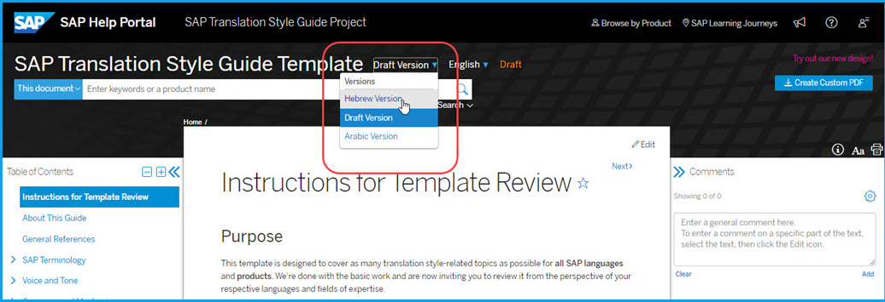
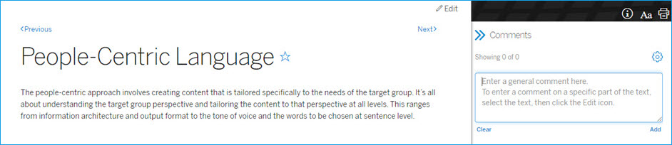
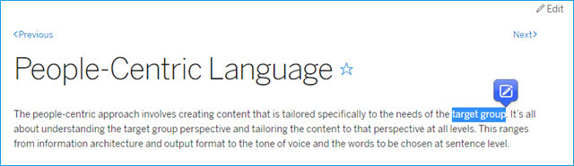

# Instructions for Template Review

## Purpose

This template is designed to cover as many translation style-related topics as possible for **all SAP languages** and **products**. We're done with the basic work and are now inviting you to review it from the perspective of your respective languages and fields of expertise.

We are fully aware that this template is far from being complete. We need your expert knowledge and experience to improve it so it will better serve as a common framework that helps all language suppliers update and maintain SAP's translation style guides in a standard and consistent manner.

## Expectations

Here are the five main aspects we want you to focus on during this exercise:

* **Categorization and overall organization of topics:** Topics are categorized and grouped under their respective headings. We want you to take a high-level view of the structure of the template and tell us whether it generally works or not.
* **Topics missing for your language:** It may be a general or language-specific topic. Since the template is for all SAP languages, we want it to be as comprehensive as possible to start with. We have a way of dealing with topics that are only applicable to some languages. No need to worry about relevance to all languages.
* **Topics not applicable to your language:** As we mentioned above, we tried to create a template as comprehensive as possible for all SAP languages. If you find a topic that is not relevant for your language, please let us know in the comments section for that topic.
* **Descriptions wrong or inappropriate for your language:** As a rule, we provided roughly three types of information for each topic. First, a brief description of what each topic is about. Second, depending on the topic, SAP's guidelines for languages to follow for product translation. Third, instructions for editors that explain what we expect them to contribute to the topic for their language. We want you to see if our expectations are clear enough for editors to understand. No need to provide any guidelines for your language during this exercise. You should also inform us of any SAP guidelines that don't fit your language. For easy identification, the first two types of information are written in regular font style while the third in italics.
* **Other areas of improvement:** Any other ideas to help us improve the SAP Product Style Guide are welcome.

## How To Find Template for Your Language

First of all, make sure that you are viewing the template version for your language. To change the language, click the language selector next to the title "SAP Translation Style Guide Template" and select your language from the drop-down menu.

> ## **For Arabic and Hebrew Only**
>
> Arabic and Hebrew must be selected from the version selector next to the title.
>
> 

Once you find your template, be sure to subscribe to it by clicking the settings icon in the **Comments** pane and selecting **Subscribe to Guide**. This allows you to receive an email notification when there is a response to your comment. You can choose the frequency of notification as well.

If the pane is not visible, you can show it by clicking the **Comments** icon  on the right side of the page.

## How To Provide Feedback

There are two ways to provide feedback directly on any Help Portal page. One is to use the **Comments** pane on the right side of the page. This may be good to use for a general comment about the topic.

The other is to use the inline comment functionality. This may be good to use for a comment on a specific part of the text. Highlight the text you want to comment on and click the Edit icon that pops up.

Feedback on missing topics, the overall structure of the template, or the general impression of the project can be entered as general comments in the topic [About This Guide](00_about.md).

In the case of languages with multiple translation suppliers, you may see comments from reviewers of other suppliers. You are welcome to **Reply** to provide your input on others' comments in the **Comments** pane.

## Post-Review Communication

After your review is over, we will **Reply** to your comment from the **Comments** pane in case of question or clarificaiton. Make sure you remain subscribed to the template so you will be notified of it by email. We will appreciate it if you can **Reply** back to us in the pane.

## Thank You

We very much appreciate your participation in this exercise. **Never hesitate** to let us know if more time is necessary for you to do a thorough review. We look forward to hearing your thoughts on the template.

Best regards,

Style Guide Update Project Team (Jaismin, Jennifer, Koichi, Samira)

