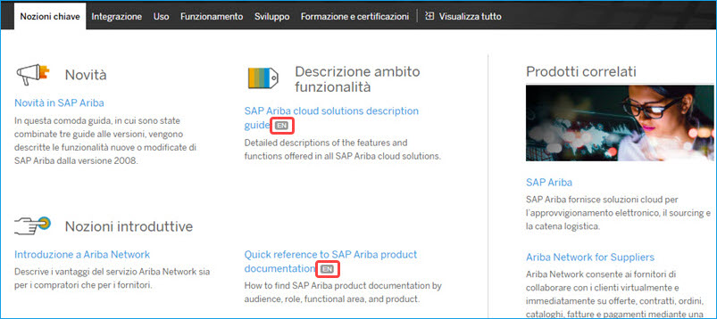

# English-only Items

* *Provide guidelines on how to handle references to English-only items such as UI terms of untranslated SAP or third-party products and the title of a document or web page that is not translated in your language.*
   * *On a product page on Help Portal, an indicator "EN" appears next to untranslated document titles.*
       

* *Include the instruction not to add "English-only" in parentheses to such references if your policy is to leave them in English because the situation may change over time.*

* *Do not forget to include the instruction to submit a query if you are not sure if such references are translated in your language or not.*

### Related Information
