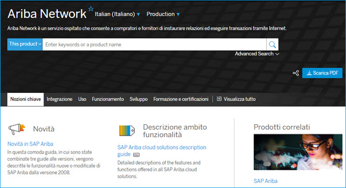

# Titles on Product Page

A product page is a page in the SAP Help Portal that groups deliverables for a particular product. Content on product pages is structured by content categories, and optionally can be distributed over various tabs. Sidebars are also used to offer supplementing information or feature content.

The SAP Help Portal offers different language versions for product pages and provides a language selector to switch between language versions of a product page.
Translated product pages containing deliverables that are available in English only display an EN indicator next to the deliverable.

Manually created product pages are assigned a unique object type (for example, IXPP in DNW) and translated like any other topics. Depending on the product, the titles of untranslated deliverables may be made available for translation. Follow the guideline below on how to handle such titles:

*Choose one of the following statements that suits your language, or provide your own if none of them works. Delete what's not necessary including this instruction.*

* Leave the text untranslated. The EN indicator also appears next to the title.

*Or*

* Translate the text. The EN indicator appears next to the title.

*Or*

* Leave the text untranslated while providing its translation in parentheses regardless of the EN indicator.