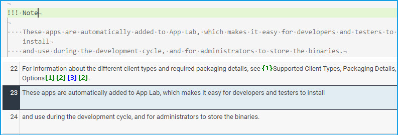
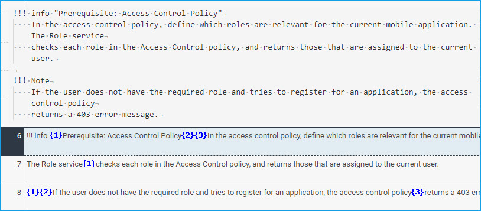
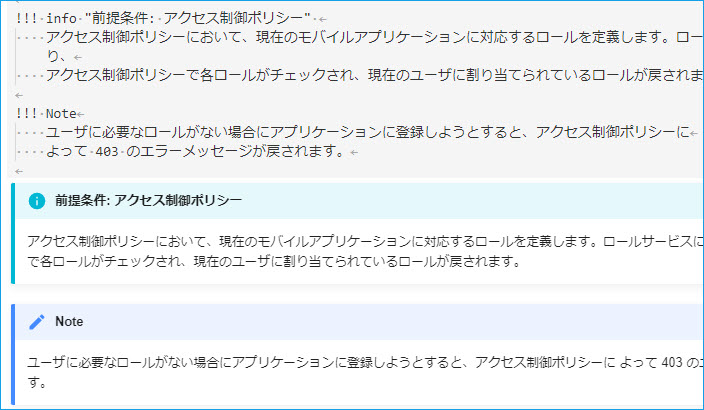

# Admonitions

**Guidelines**

* Always provide a title, even if the same as the type qualifier.
* Add a blank line below the syntax.

**Example**
```
!!! Note "Note"

    Some text to follow.
```
**Benefits**

* Protection of the syntax
* Better segmentation
* Correct icon display in target
* Translated titles in target.

    
    
    


