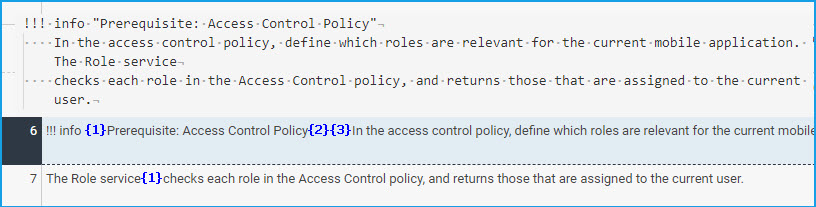
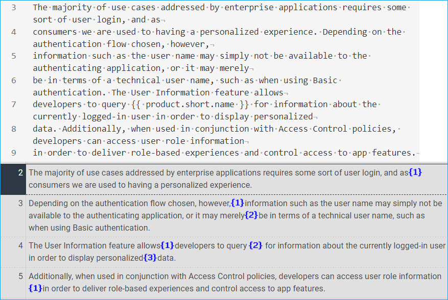

# Line Breaks

**Guidelines**

* Avoid entering line breaks within the same sentence, unless required (for instance, in codeblocks).
* Enter a blank line after headlines, between paragraphs, and before and after text blocks and other block elements, unless prohibited.

**Benefits**

* Reduce chances of merged texts
* Better translation reuse

    
    
