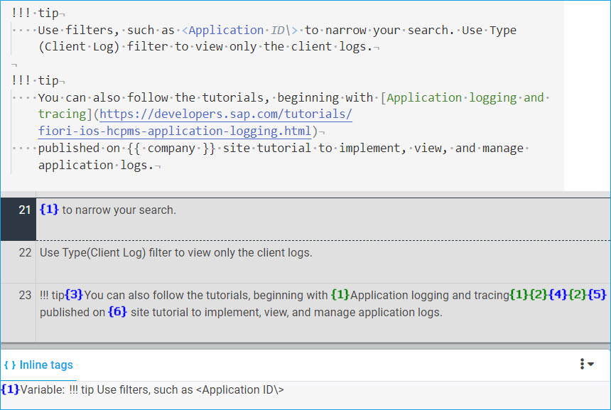

# Overview

* Markdown is a new file format for LX to handle.
* Markdown is fundamentally different from DITA in that its syntax relies on certain characters (including whitespaces) for styling.
* The syntax characters are configured for the translation system to parse as elements in order to:
    * protect them from being inadvertently translated
    * expose all other translation-relevant texts
    * help reduce translation cost
    * realize translated output as originally designed
* A certain set of rules for using the syntax characters will help make their configuration clean and manageable, especially in view of the flexible nature of the Markdown language.
    * Areas of consideration include:
        * [admonitions](admonitions.md)
        * [font style semantics](font_style.md)
        * [tables](tables.md)
        * [line breaks](line_breaks.md)
        * [special characters](special_characters.md)
        * [content in admonitions (text blocks)](text_block_content.md)
        * embedded HTML elements\* (*to be checked*)
* Ideas for support
    * Source
        * Perform checks during English build for non-compliant files
        * Alternatively, sanity checks during TEW upload to reject non-compliant files\* (*subject to LX dev availability*)
    * Target
        * Sanity checks during TEW download for non-compliant files\* (*subject to LX dev availability*)
        * QA checks during translaiton in the translation editor\* (*to be checked*)
* Concerns
    * Ability to generate target output **a must** to ensure appropirate handling of the syntax characters and translation-relevant texts at an early stage of translation, if not prior to translation
    * Items that currently remain untranslated:
        * URL in links
        * icon alt texts
    * Limited support for italics with Asian languages
* For correction
    * "<Application ID\\>" (docs\guides\features\logging\admin\client-logs.md): Escape leading angle bracket

    
