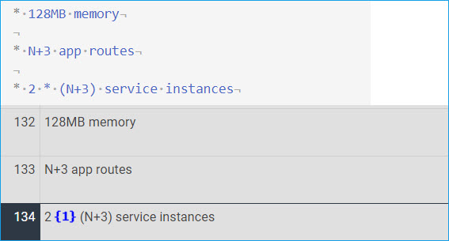
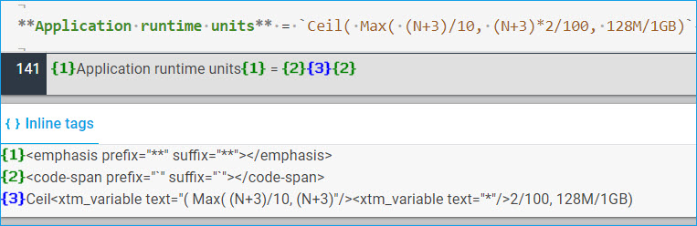

# Special Characters

**Guidelines**

* Always escape special characters when used as ordinary characters.
* Not necessary when in inline code.

**Benefits**

* Easy identification as ordinary characters
* Possible to translate if necessary

    
    
    