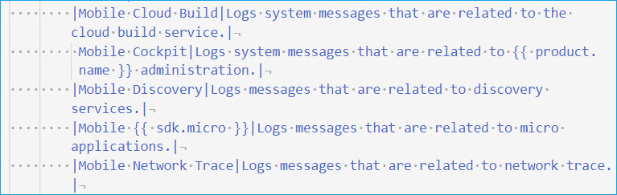

# Tables

**Guidelines**

* Determine if leading and trailing pipes are required or not.
* Determine if a space is required between pipes and cell content.

**Benefits**

* Simpler syntax configuration
* See also [content in admonitions (text blocks)](text_blocks.md) 
    
    