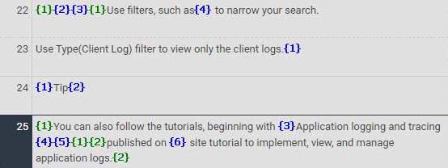
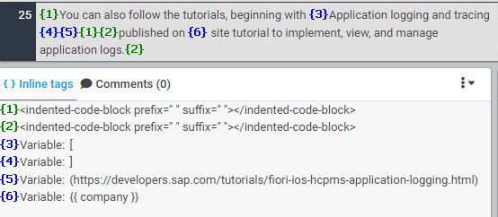

# Inline Tags

There are two types of inline tags. One is numbered green tags in pairs and the other sequentially numbered blue tags. These can appear together in a segment.

> 

It is important to check what each tag represents in the **Inline tags** view of XTM Workbench so they are treated as they should. Failure to do so can result in malformed or incorrect output.

> 

The information in the **Inline tags** view tells the purposes of inline tags and what they actually stand for. These include:

* [Font style](font_style.md)
* [Named parameter](named_parameter.md)
* [Hyperlink](hyperlink.md)
* [Image/Icon](image_icon.md)
* [Inline code](inline_code.md)
* [Indented code block](indented_code_block.md)
* [Whitespace character](whitespace_character.md)
* [Newline character](newline_character.md)
* [Custom-defined markups](variable.md)

> The **Visual mode** available for DITA translation is currently unavailable for Markdown. The English output in HTML can be viewed by downloading and opening the zip file attached to your XTM project.