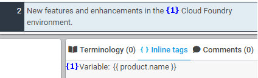
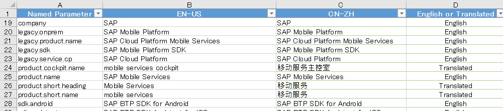

# Named Parameter

Defined as a variable, the named parameter tag consists of a pair of two curly brackets ("{{" and "}}") and the parameter name. The actual value of the parameter is translated in a file called "translation.properties.xlf" and is made vislbe only in the HTML output.

| XTM Workbench | HTML Output |
| --- | --- |
|  |  |

In the above example, the named parameter {{ product.name }} is rendered as the text "SAP Mobile Services" in the output.

Since the actual values of named parameters are not visible in XTM Workbench, a list of named parameter values and their translation is provided as a reference for the XTM project.

