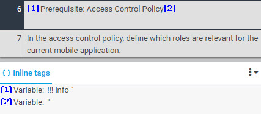
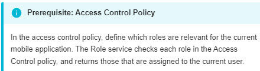
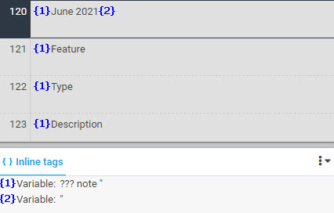
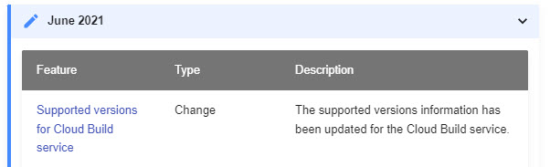

# Admonitions

An admonition is a text block with an icon, title, and texts in a special format.

The admonition syntax (three exclamation marks "!!!", or three questions marks "???", followed by a space and a type qualifier such as "Note", "Info", and "Tip") may appear as a variable tag or texts. Either way, the syntax must not be translated.

| XTM Workbench | HTML Output |
| --- | --- |
|  |  |
|  |  |

