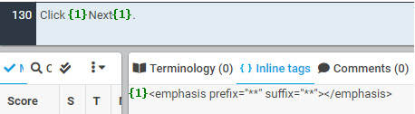
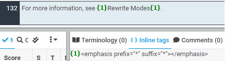
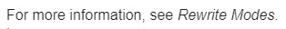

# Font Style

A pair of green tags named "emphasis" is responsible for bold and italics font styles.

**Bold**: Contains a pair of two asterisks (\*\*). Typically used to indicate UI texts.

| **XTM Workbench** | HTML Output |
| --- | --- |
|  |  |

**Italics**: Contains a pair of one asterisk (\*). Typically used to indicate a title with no hyperlink or emphasis.

| **XTM Workbench** |HTML Output |
| --- | --- |
|  |  |
