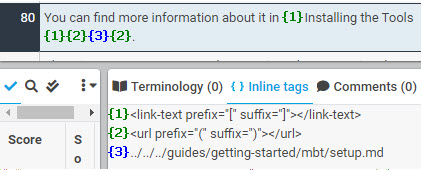
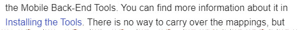
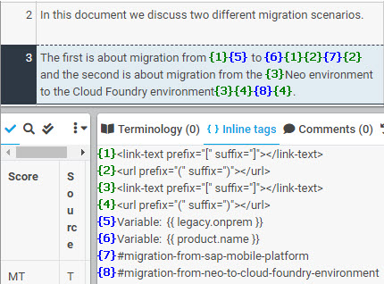
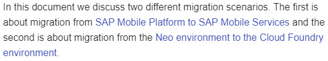

# Hyperlinked Text

A few tags are used for a hyperlinked text.

* Tag containing a pair of square brackets ("[" and "]") that wraps the text.
* Tag containing a pair of parentheses ("(" and ")") that wraps the URL or link.
* Tag for the actual URL or link.

| XTM Workbench | HTML Output |
| --- | --- |
|  |  |

Named parameter tags (and other tags) may be included as part of the text. For example:

| XTM Workbench | HTML Output |
| --- | --- |
|  |  |