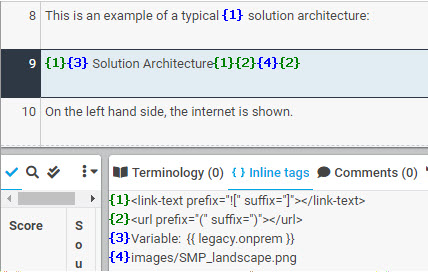
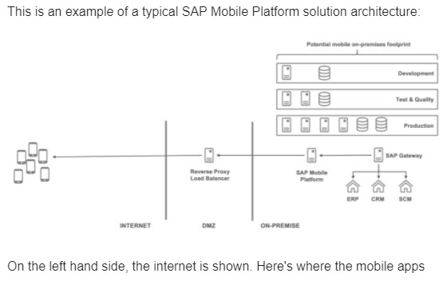
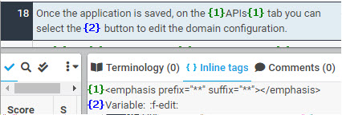
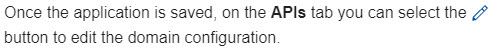

# Image/Icon

A few tags are used for an image, diagram, or screenshot.

* Tag containing markups ("![" and "]") that wrap the alt text (which may contain named parameter tags)
* Tag containing a pair of parentheses ("(" and ")") that wraps the link for the image
* Tag for the link

| XTM Workbench | HTML Output |
| --- | --- |
|  |  |

Defined as a variable, an icon tag consists of a pair of colons and the link for the icon.
| XTM Workbench | HTML Output |
| --- | --- |
|  |  |