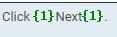

# Inline Tags

There are two types of inline tags. One is green tags in pair and the other standalone blue tags.

____

It is helpful to remember that green tags typically represent formatting such as bold and italics while blue tags represent such text elements as variables and links.

____

It is important to check what each tag represents in the **Inline tags** view of XTM Workbench so inline tags are placed in correct sequence and position in translation. Failure to do so can result in malformed or incorrect output.

____

The description of inline tags tells you purposes they serve including:

* [Font Style](font_style.md)
* [Named parameter](named_parameter.md)
* [Hyperlinked text](hyperlinked_text.md)
* [Image/Icon](image_icon.md)
* [Code](code.md)
* [Other Markdown Syntax and Markups](whitespace_newline.md)

> The **Visual mode** available for DITA translation is currently unavailable for Markdown. The English output in HTML can be viewed by downloading and opening the zip file attached to your XTM project.