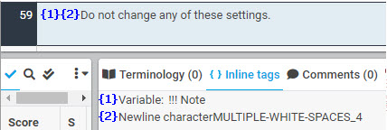
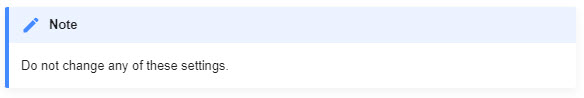
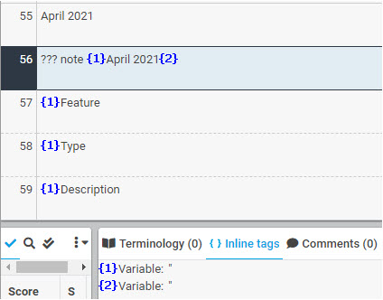
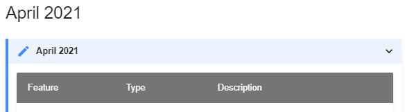
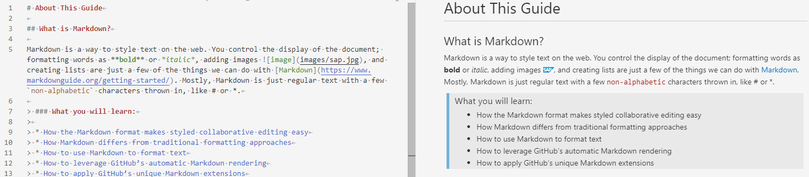

# What Is Markdown?

> This document is intended for translators working specifially on the **Markdown translation project for SCP Mobile Services**. While much of the content concerns the basic Markdown syntax, some deals with technical implementation specific to the proejct. As the standards for Markdown authoring evolve at SAP, this document will also evolve to facilitate the translation of documentation based on such standards.

| XTM Workbench | HTML Output |
| --- | --- |
|  |  |
|  |  |

Markdown is a way to style text on the web. You control the display of the document; formatting words as **bold** or *italic*, adding images , and creating lists are just a few of the things we can do with Markdown ([more info](https://www.markdownguide.org/getting-started/)). Mostly, Markdown is just regular text with a few `non-alphabetic` characters thrown in, like # or * or even " " (whitespace).

XTM parses these characters according to the Markdown syntax and displays many of them as inline tags in XTM Workbench. Content authored in Markdown heavily depends on these characters for styling so it is essneital that inline tags should be taken care of correctly in order to realize a translated output as orignally styled.