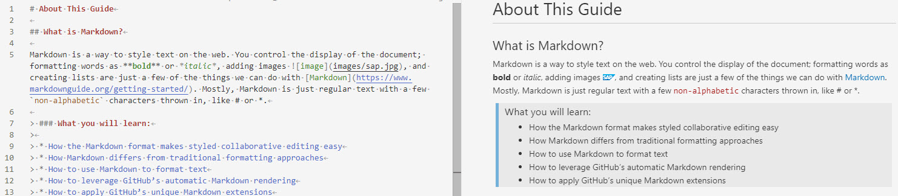

# マークダウンとは

> この文書は、**SCP Mobile Services マークダウン翻訳プロジェクトで**個別に作業する翻訳者を対象としています。内容の多くは基本的なマークダウン構文に関連しますが、一部のコンテンツではプロジェクト固有の技術実装を扱います。マークダウンオーサリングの標準が SAP で進化するため、この文書は、このような標準に基づく文書の翻訳を容易にするためにも進化していきます。

| XTM ワークベンチ | HTML 出力 |
| --- | --- |
|  |  |
|  |  |

マークダウンは、Web 上のテキストのスタイルを設定する方法です。文書の表示を制御します。単語の**書式設定は太字**または*イタリック*、イメージの追加、および一覧の登録は、 マークダウン ([追加情報](https://www.markdownguide.org/getting-started/)) で行うことができるいくつかの作業にすぎません。通常、マークダウンは通常のテキストであり、# や* (" "ホワイトスペース) などの数`non-alphabetic`文字が表示されます。

XTM は、マークダウン構文に従ってこれらの文字を解析し、その多くを XTM ワークベンチのインラインタグとして表示します。マークダウンで作成されたコンテンツは、スタイル設定のためにこれらの文字に大きく依存するため、翻訳された出力をオリジナルスタイルとして実現するには、インラインタグを正しく処理する必要があります。