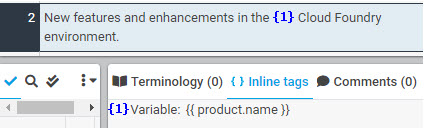
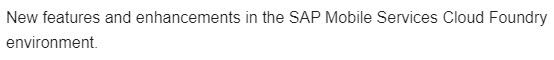

# Named Parameter

Defined as a variable, the named parameter tag consists of a pair of curly brackets ("{" and "}") and the parameter name. The actual value of the parameter is translated in a file called "translation.properties.xlf".

| XTM Workbench | HTML Output |
| --- | --- |
|  |  |
