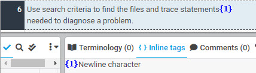
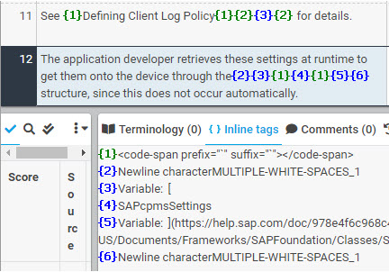
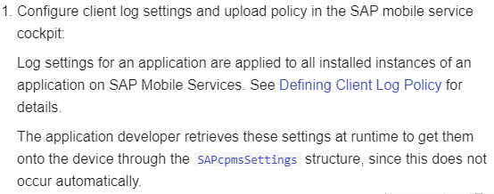

# Newline characters

Tags for newline characters can usually be placed anywhere in translation as long as they appear on their own.

| XTM Workbench | HTML Output |
| --- | --- |
|  |  |

If they appear together with other tags, it is best to position them the same way in translation.

| XTM Workbench | HTML Output |
| --- | --- |
|  |  |