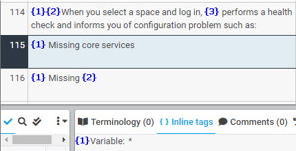
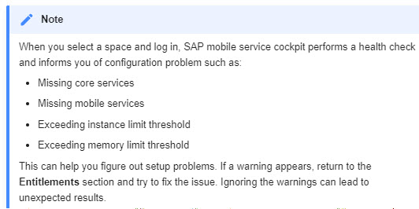
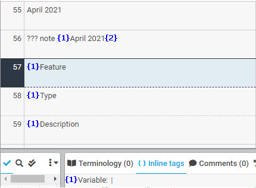
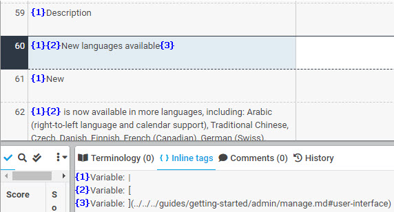
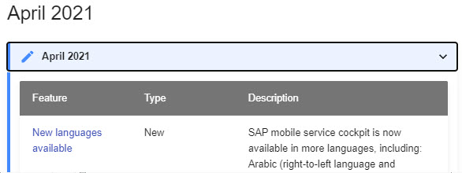

# Variable

Markdown markups sometimes need to be defined specifically as a variable due to the structure of the text. For instance, the following shows the markup (an asterisk "*") for a bulleted list as a variable. Translation must retain the space between the variable tag and the text for the bulleted list:

| XTM Workbench | HTML Output |
| --- | --- |
|  |  |

Here is an example of a defined variable tag for the markup (a pipe "|" character) for a table.

| XTM Workbench | HTML Output |
| --- | --- |
|  |  |

Here is an example of defined variable tags for the table markup and hyperlink markups.

| XTM Workbench | HTML Output |
| --- | --- |
|  |  |