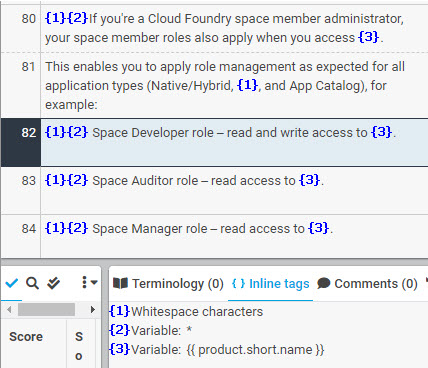

# Whitespace Characters

Tags for whitespace characters must be placed at the very start of the translation. The example below shows a whitespace tag together with the variable tag for a bulleted list.

| XTM Workbench | HTML Output |
| --- | --- |
|  |  |