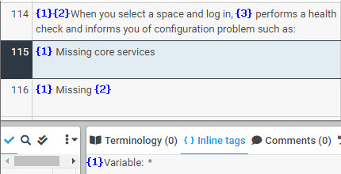
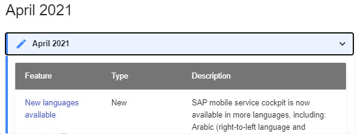
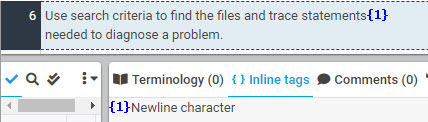
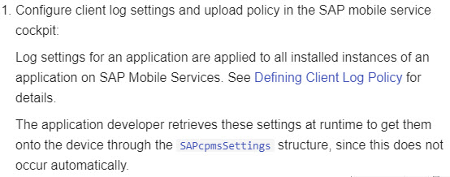

# Other Markdown Syntax and Markups

Other Markdown syntax and markups can appear as tags under certain circumstances with various descriptions such as "Variable", "Whitespace characters", and "Newline characters".

### **Variable**

Markdown markups sometimes need to be defined specifically as a variable due to the structure of the text. For instance, the following shows the markup (an asterisk "*") for a bulleted list as a variable. Translation must retain the space between the variable tag and the text for the bulleted list:

| **XTM Workbench** | **HTML Output** |
| --- | --- |
|  |  |

Here is an example of a defined variable tag for the markup (a pipe "|" character) for a table.

| **XTM Workbench** | **HTML Output** |
| --- | --- |
|  |  |

Here is an example of defined variable tags for the table markup and hyperlink markups.

| **XTM Workbench** | **HTML Output** |
| --- | --- |
|  |  |

### **Whitespace characters**

Tags for whitespace characters must be placed at the very start of the translation. The example below shows a whitespace tag together with the variable tag for a bulleted list.

| **XTM Workbench** | **HTML Output** |
| --- | --- |
|  |  |

### **Newline characters**

Tags for newline characters can usually be placed anywhere in translation as long as they appear on their own.

| **XTM Workbench** | **HTML Output** |
| --- | --- |
|  |  |

If they appear together with other tags, it is best to position them the same way in translation.

| **XTM Workbench** | **HTML Output** |
| --- | --- |
|  |  |